# Diagrama de Arquitectura Onion - API Calendario

API RESTful desarrollada en Spring Boot sobre PostgreSQL. Es cliente de la API Festivos,
de la cual obtiene la lista de festivos de un año.

La arquitectura onion organiza la API en anillos concéntricos. El dominio y el core
están en el centro: definen los datos y los contratos (interfaces) y no dependen de
ningún framework ni de la base de datos. Los anillos exteriores implementan o usan esos
contratos, así que **todas las dependencias apuntan hacia el dominio y el core** y
ninguna sale de ellos.

En el diagrama, cada módulo está dentro del anillo al que pertenece: el dominio dentro del
core, el core dentro de la aplicación, y la infraestructura y la presentación en el anillo
exterior. El cliente, la base de datos y la API Festivos quedan por fuera de la cebolla
porque no son módulos de la API: el cliente la consume, y la infraestructura se comunica
con la base de datos y con la API Festivos.

```mermaid
graph TD
    %% Anillo exterior: infraestructura y presentación
    subgraph Exterior [Anillo exterior]
        direction TB

        %% Módulo Presentación
        subgraph Presentacion [Módulo: presentacion]
            ApiApp[ApiApplication @SpringBootApplication]
            Controladores[CalendarioControlador]
            Configuracion[SwaggerConfig]
            Handlers[ExcepcionesGlobalesHandler]
            DtosPresentacion[ErrorRespuesta]
        end

        %% Módulo Infraestructura
        subgraph Infraestructura [Módulo: infraestructura]
            RepositoriosImpl[CalendarioRepositorio / TipoRepositorio]
            RepositoriosJPA[ICalendarioRepositorioJpa / ITipoRepositorioJpa]
            EntidadesJPA[CalendarioEntidad / TipoEntidad]
            Mapeadores[CalendarioMapeador / TipoMapeador]
            IntegracionExt[FestivoServicioExterno / HttpServicio]
        end

        %% Módulo Aplicación
        subgraph Aplicacion [Módulo: aplicacion]
            ServiciosApp[CalendarioServicio]

            %% Módulo Core
            subgraph Core [Módulo: core]
                InterfacesServicio[ICalendarioServicio]
                InterfacesRepo[ICalendarioRepositorio / ITipoRepositorio]
                InterfacesIntegracion[IFestivoServicioExterno]

                %% Módulo Dominio
                subgraph Dominio [Módulo: dominio]
                    Entidades[Calendario / Tipo]
                    DTOs[FestivoDto]
                end
            end
        end
    end

    %% Fuera de la API: cliente y sistemas externos
    subgraph Externos [Fuera de la API]
        Cliente[Cliente<br/><i>Postman / Swagger UI</i>]
        DB[(Base de Datos: PostgreSQL)]
        APIExterna[API Festivos]
    end

    %% Cliente -> Presentación
    Cliente -->|"GET /api/calendario/generar/{anio}"| Controladores
    Cliente -->|"GET /api/calendario/listar/{anio}"| Controladores

    %% Relaciones Aplicación -> Core / Dominio
    ServiciosApp -.->|Implementa| InterfacesServicio
    ServiciosApp -->|Inyecta| InterfacesRepo
    ServiciosApp -->|Inyecta| InterfacesIntegracion
    ServiciosApp -->|Maneja| Entidades
    ServiciosApp -->|Maneja| DTOs

    %% Relaciones Infraestructura -> Core / Dominio
    RepositoriosImpl -.->|Implementa| InterfacesRepo
    RepositoriosImpl -->|Inyecta| RepositoriosJPA
    RepositoriosImpl -->|Usa| Mapeadores
    RepositoriosImpl -->|Retorna| Entidades
    Mapeadores -->|Transforma| Entidades
    Mapeadores -->|Transforma| EntidadesJPA
    IntegracionExt -.->|Implementa| InterfacesIntegracion
    IntegracionExt -->|Crea| DTOs

    %% Relaciones Infraestructura -> Sistemas externos
    IntegracionExt -->|"RestTemplate / GET /api/festivos/obtener/{anio}"| APIExterna
    RepositoriosJPA -->|Spring Data JPA / SQL| DB
    EntidadesJPA -->|Mapeo ORM @Entity| DB

    %% Relaciones Presentación -> Core / Dominio
    Controladores -->|Inyecta| InterfacesServicio
    Controladores -->|Usa| Entidades

    %% Relaciones internas de Presentación
    ApiApp -->|Arranca y escanea| Controladores
    Configuracion -->|Documenta| Controladores
    Handlers -->|Intercepta excepciones de| Controladores
    Handlers -->|Responde con| DtosPresentacion

    %% Estilos de los anillos
    style Exterior fill:#fff3e0,stroke:#f57c00,stroke-width:2px
    style Aplicacion fill:#e8f5e9,stroke:#388e3c,stroke-width:2px
    style Core fill:#e1f5fe,stroke:#0288d1,stroke-width:2px
    style Dominio fill:#f3e5f5,stroke:#7b1fa2,stroke-width:2px
    style Externos fill:#ffebee,stroke:#d32f2f,stroke-width:2px
```

## Relaciones

| Relación | Línea | Significado |
|---|---|---|
| GET con una ruta | continua | Petición HTTP: del cliente al controlador, y de la integración a la API Festivos. La respuesta recorre el camino inverso |
| Implementa | punteada | La clase implementa una interfaz definida en el core. No es un llamado directo |
| Inyecta | continua | La clase recibe por inyección de dependencias una instancia que crea Spring (`@Autowired`) |
| Maneja / Usa | continua | La clase trabaja con objetos del dominio o DTOs, que fluyen por todos los módulos |
| Retorna | continua | Los repositorios entregan al servicio objetos del dominio, nunca entidades JPA |
| Transforma | continua | Los mapeadores convierten entre entidades del dominio y entidades JPA, en los dos sentidos |
| Crea | continua | `FestivoServicioExterno` convierte el JSON de la API Festivos en objetos `FestivoDto` |
| Arranca, Documenta, Intercepta, Responde con | continua | Relaciones internas de la presentación: arranque de Spring, documentación con Swagger y manejo de errores |

Ninguna flecha sale del dominio ni del core hacia los anillos exteriores: el core solo
conoce al dominio (sus interfaces usan `Calendario`, `Tipo` y `FestivoDto`) y el dominio
no conoce a nadie. Por eso la base de datos o la API Festivos se pueden reemplazar sin
cambiar el núcleo ni la lógica de negocio.

## Módulos

La API se divide en cinco módulos Maven, organizados en anillos del centro hacia afuera.

| Anillo | Módulo | Contenido | Dependencia de framework |
|---|---|---|---|
| Centro | dominio | Entidades del dominio (`Calendario`, `Tipo`) y DTOs (`FestivoDto`) | Ninguna, Java puro |
| Centro | core | Interfaces de servicio, de repositorio y de integración externa | Ninguna, Java puro |
| Medio | aplicacion | Implementación de los servicios (`@Service`), con la lógica de negocio | Spring |
| Exterior | infraestructura | Persistencia (entidades JPA, repositorios JPA, implementación de los repositorios y mapeadores) e integración con la API Festivos | Spring Data JPA, `RestTemplate` |
| Exterior | presentacion | Clase principal, controladores REST, configuración de Swagger y manejo global de excepciones | Spring Web |

Los repositorios JPA son interfaces que extienden `JpaRepository`. No se programan: Spring
Data JPA los implementa automáticamente.

## Operaciones de la API

| Operación | Método | Ruta | Respuesta |
|---|---|---|---|
| Generar el calendario de un año | GET | `/api/calendario/generar/{anio}` | `true` si el proceso terminó con éxito |
| Listar el calendario de un año | GET | `/api/calendario/listar/{anio}` | Lista de días con su fecha, tipo y descripción |

Generar usa `GET`, como en la solicitud de ejemplo del enunciado, aunque guarda datos.

## Flujo de generar el calendario

1. El cliente llama `GET /api/calendario/generar/{anio}`.
2. `CalendarioControlador` invoca `ICalendarioServicio`. Spring inyecta la implementación
   `CalendarioServicio`.
3. `CalendarioServicio` pide los festivos del año a `IFestivoServicioExterno`. Su
   implementación, `FestivoServicioExterno`, llama `GET /api/festivos/obtener/{anio}` de la
   API Festivos con el `RestTemplate` configurado en `HttpServicio` y convierte el JSON
   recibido en objetos `FestivoDto`.
4. `CalendarioServicio` lee de `ITipoRepositorio` los tres tipos del catálogo (*Día
   laboral*, *Fin de semana* y *Día festivo*), para asignar a cada día un objeto `Tipo`.
5. `CalendarioServicio` recorre los días del 1 de enero al 31 de diciembre y clasifica cada
   uno como *Día festivo* si está en la lista de festivos, como *Fin de semana* si es sábado
   o domingo, o como *Día laboral* en los demás casos.
6. `CalendarioServicio` elimina los días que ya existan para ese año, para que generar el
   mismo año dos veces no duplique registros, y guarda los nuevos a través de
   `ICalendarioRepositorio`. El borrado y el guardado se ejecutan en una sola transacción
   (`@Transactional`): si el guardado falla, el borrado se revierte y el calendario que
   existía para ese año no se pierde.
7. `CalendarioRepositorio` transforma los objetos del dominio en `CalendarioEntidad` con
   `CalendarioMapeador` y los guarda en PostgreSQL con `ICalendarioRepositorioJpa`.
8. El controlador responde `true` con código 200. Si la API Festivos no responde o falla el
   guardado, responde `false` (ver [Manejo de errores](#manejo-de-errores)).

Listar el calendario recorre el camino inverso: el repositorio JPA consulta los días del
año junto con su tipo (relación `@ManyToOne`), el mapeador los transforma en objetos del
dominio y el controlador los serializa a JSON.

## Manejo de errores

| Situación | Respuesta | Quién la produce |
|---|---|---|
| El año no es un número (por ejemplo, `/generar/abc`) | 400 con un `ErrorRespuesta` | `ExcepcionesGlobalesHandler` |
| Generar: la API Festivos no responde o falla el guardado | 200 con `false` | `CalendarioControlador` |
| Listar un año que no se ha generado | 200 con una lista vacía | `CalendarioControlador` |
| Cualquier otro error no previsto | 500 con un `ErrorRespuesta` | `ExcepcionesGlobalesHandler` |

El enunciado pide que generar retorne un booleano, por eso los fallos del proceso se
informan con `false` y no con una excepción hacia el cliente. Para que la transacción se
revierta, `CalendarioServicio` no captura el error: la excepción sale del método
transaccional y `CalendarioControlador` la convierte en `false`.
`ExcepcionesGlobalesHandler` (`@RestControllerAdvice`) atiende los errores que ocurren antes
o por fuera de ese proceso, y responde siempre con la misma estructura, `ErrorRespuesta`.

## Decisiones de diseño

- **La API Festivos es una integración externa.** El core define la interfaz
  `IFestivoServicioExterno` y la llamada HTTP se implementa en la infraestructura, en
  `FestivoServicioExterno`. Si la API Festivos cambia, el servicio no se modifica.
- **El cliente, la base de datos y la API Festivos están fuera de la cebolla.** No son
  módulos de la API: el cliente la consume y la infraestructura se comunica con los otros dos.
- **`FestivoDto` es un DTO, no una entidad.** Representa cada festivo que entrega la API
  Festivos (`festivo` y `fecha`), no se guarda en la base de datos y solo se usa para
  clasificar los días.
- **En el dominio, `Calendario` contiene un objeto `Tipo`, no un `IdTipo`.** La llave
  foránea solo existe en la entidad JPA, con `@ManyToOne` y `@JoinColumn`. Por eso la
  respuesta de listar incluye el tipo completo (`"tipo": {"id": 3, "tipo": "Día festivo"}`).
- **No hay CRUD de `Tipo`.** Es un catálogo fijo de tres registros que solo se consulta:
  `CalendarioServicio` lo lee con `ITipoRepositorio` para asignar el tipo a cada día.
- **La seguridad por token no se incluye.** El enunciado no pide autenticación para esta
  API: no define una operación de login ni usuarios, y su modelo relacional solo tiene las
  tablas `Tipo` y `Calendario`. Por eso, frente al diagrama de ejemplo de la API Monedas, no
  aparecen la entidad `Usuario`, los componentes de seguridad de la aplicación ni
  `ConfiguracionSeguridad`.

El modelo de la base de datos está en el
[diagrama relacional](diagrama-relacional-api-calendario.md).
