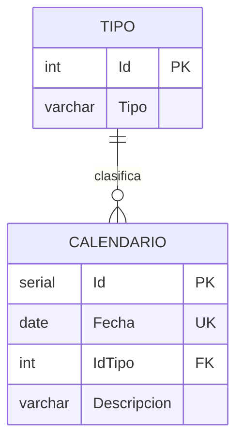

# Diagrama Relacional - API Calendario

Modelo de la base de datos PostgreSQL de la API Calendario (Spring Boot), tomado del
enunciado del Taller 1.

La tabla `Tipo` es un catálogo con las clasificaciones posibles de un día, y la tabla
`Calendario` guarda cada uno de los días de un año con su clasificación.

## Descripción de las tablas

### Tipo

| Columna | Tipo | Descripción |
|---|---|---|
| Id | int | Identificador del tipo de día |
| Tipo | varchar | Nombre del tipo de día |

Registros:

| Id | Tipo | Regla |
|---|---|---|
| 1 | Día laboral | Lunes a viernes que no es festivo |
| 2 | Fin de semana | Sábado o domingo que no es festivo |
| 3 | Día festivo | Fecha incluida en la lista de festivos del año que entrega la API Festivos |

Los ids coinciden con la respuesta de ejemplo del enunciado, donde el *Día laboral* tiene
id 1 y el *Día festivo* id 3. El *Fin de semana* toma el id 2.

### Calendario

| Columna | Tipo | Descripción |
|---|---|---|
| Id | serial | Identificador autonumérico del día |
| Fecha | date | Fecha del día. Es única (`UK`): cada día se guarda una sola vez |
| IdTipo | int | Llave foránea hacia `Tipo` |
| Descripcion | varchar | Nombre del día de la semana (Lunes, Martes, ..., Domingo) |

Un festivo tiene prioridad sobre el fin de semana. Por ejemplo, el 1 de enero de 2023
cae domingo y se clasifica como *Día festivo* con descripción *Domingo*, tal como aparece
en la respuesta de ejemplo del enunciado.

La restricción única sobre `Fecha` garantiza en la base de datos que generar el mismo año
dos veces no duplique días, además del borrado previo que hace la API (ver el
[flujo de generar el calendario](diagrama-arquitectura-api-calendario.md#flujo-de-generar-el-calendario)).
